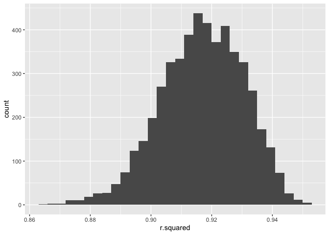
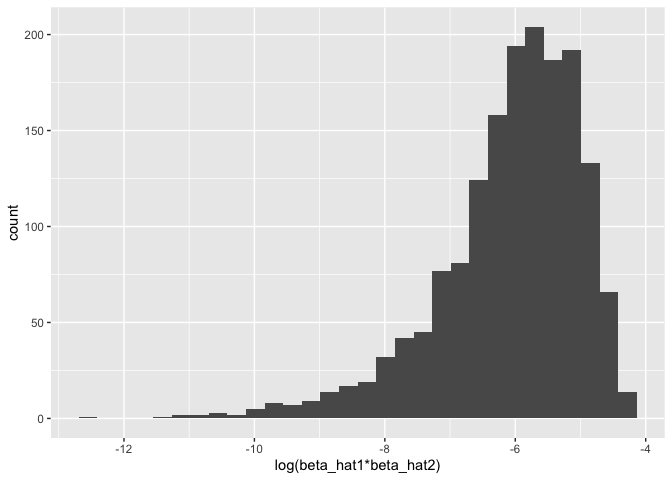
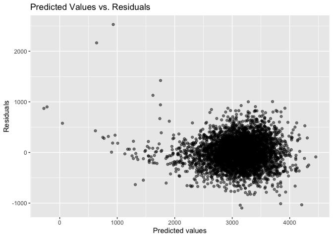
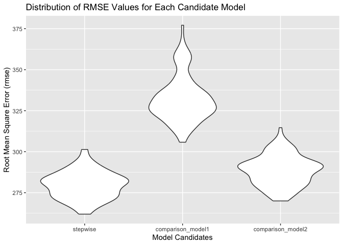

p8105_hw6_wz2630
================

``` r
library(dplyr)
```

    ## 
    ## Attaching package: 'dplyr'

    ## The following objects are masked from 'package:stats':
    ## 
    ##     filter, lag

    ## The following objects are masked from 'package:base':
    ## 
    ##     intersect, setdiff, setequal, union

``` r
library(tidyverse)
```

    ## ── Attaching core tidyverse packages ──────────────────────── tidyverse 2.0.0 ──
    ## ✔ forcats   1.0.0     ✔ readr     2.1.4
    ## ✔ ggplot2   3.4.3     ✔ stringr   1.5.0
    ## ✔ lubridate 1.9.3     ✔ tibble    3.2.1
    ## ✔ purrr     1.0.2     ✔ tidyr     1.3.0

    ## ── Conflicts ────────────────────────────────────────── tidyverse_conflicts() ──
    ## ✖ dplyr::filter() masks stats::filter()
    ## ✖ dplyr::lag()    masks stats::lag()
    ## ℹ Use the conflicted package (<http://conflicted.r-lib.org/>) to force all conflicts to become errors

``` r
library(modelr)
library(knitr)
library(purrr)
library(mgcv)
```

    ## Loading required package: nlme
    ## 
    ## Attaching package: 'nlme'
    ## 
    ## The following object is masked from 'package:dplyr':
    ## 
    ##     collapse
    ## 
    ## This is mgcv 1.9-0. For overview type 'help("mgcv-package")'.

# Problem 1

(omitted)

# Problem 2

## Dataset:

``` r
weather_df = 
  rnoaa::meteo_pull_monitors(
    c("USW00094728"),
    var = c("PRCP", "TMIN", "TMAX"), 
    date_min = "2022-01-01",
    date_max = "2022-12-31") |>
  mutate(
    name = recode(id, USW00094728 = "CentralPark_NY"),
    tmin = tmin / 10,
    tmax = tmax / 10) |>
  select(name, id, everything())
```

    ## using cached file: /Users/wendyzhou/Library/Caches/org.R-project.R/R/rnoaa/noaa_ghcnd/USW00094728.dly

    ## date created (size, mb): 2023-10-05 10:33:23.821468 (8.527)

    ## file min/max dates: 1869-01-01 / 2023-10-31

## Bootstrapping

The boostrap is helpful when you’d like to perform inference for a
parameter / value / summary that doesn’t have an easy-to-write-down
distribution in the usual repeated sampling framework. We’ll focus on a
simple linear regression with tmax as the response with tmin and prcp as
the predictors, and are interested in the distribution of two quantities
estimated from these data:

- r_hat^2
- log(beta_hat1\*beta_hat2)

1.  Use 5000 bootstrap samples and, for each bootstrap sample, produce
    estimates of these two quantities.

2.  Plot the distribution of your estimates, and describe these in
    words.

3.  Using the 5000 bootstrap estimates, identify the 2.5% and 97.5%
    quantiles to provide a 95% confidence interval for r_hat^2 and
    log(beta_hat1\*beta_hat2).

Note: broom::glance() is helpful for extracting r_hat^2 from a fitted
regression, and broom::tidy() (with some additional wrangling) should
help in computing log(beta_hat1\*beta_hat2).

``` r
set.seed(1)

n_samp = 5000

# define boot_sample function
boot_sample = 
  function(df) {sample_frac(df, replace = TRUE)}

# generate bootstrap samples
boot_straps = 
  tibble(strap_number = 1:5000) |> 
  mutate(
    strap_sample = map(strap_number, \(i) boot_sample(df = weather_df))
    )

boot_straps
```

    ## # A tibble: 5,000 × 2
    ##    strap_number strap_sample      
    ##           <int> <list>            
    ##  1            1 <tibble [365 × 6]>
    ##  2            2 <tibble [365 × 6]>
    ##  3            3 <tibble [365 × 6]>
    ##  4            4 <tibble [365 × 6]>
    ##  5            5 <tibble [365 × 6]>
    ##  6            6 <tibble [365 × 6]>
    ##  7            7 <tibble [365 × 6]>
    ##  8            8 <tibble [365 × 6]>
    ##  9            9 <tibble [365 × 6]>
    ## 10           10 <tibble [365 × 6]>
    ## # ℹ 4,990 more rows

``` r
# generate the estimates of interest
bootstrap_results = 
  boot_straps |> 
  mutate(
    models = map(strap_sample, \(df) lm(tmax ~ tmin+prcp, data = df) ),
    results_1 = map(models, broom::tidy),
    results_2 = map(models, broom::glance)) |> 
  select(-strap_sample, -models) |> 
  unnest(results_1, results_2) 
```

    ## Warning: `unnest()` has a new interface. See `?unnest` for details.
    ## ℹ Try `df %>% unnest(c(results_1, results_2))`, with `mutate()` if needed.

``` r
# pivot results dataset
pivot_bootstrap_results = 
  bootstrap_results |> 
  select(strap_number, term, estimate, r.squared)|>
  pivot_wider(
    names_from = term,
    values_from = estimate
  ) |> 
  mutate(quantity2 = ifelse(tmin * prcp <= 0, NA, log(tmin * prcp)))
```

    ## Warning: There was 1 warning in `mutate()`.
    ## ℹ In argument: `quantity2 = ifelse(tmin * prcp <= 0, NA, log(tmin * prcp))`.
    ## Caused by warning in `log()`:
    ## ! NaNs produced

``` r
# Plot the distribution of your estimates
pivot_bootstrap_results |> 
  ggplot(aes(x = r.squared)) + 
  geom_histogram()
```

    ## `stat_bin()` using `bins = 30`. Pick better value with `binwidth`.

<!-- -->

``` r
pivot_bootstrap_results |> 
  ggplot(aes(x = quantity2)) + 
  geom_histogram() + 
  labs(x = "log(beta_hat1*beta_hat2)")
```

    ## `stat_bin()` using `bins = 30`. Pick better value with `binwidth`.

    ## Warning: Removed 3361 rows containing non-finite values (`stat_bin()`).

<!-- -->

**Comments:**

The distribution of r-squared estimates are approximately normal. The
r-squared values range from 0.86 to 1 and counts range from 0 to about
490.

The distribution of log(beta_hat1xbeta_hat2) is left skewed. There seems
to be outliers based on the histogram.

- Applying log(tmin \* prcp) produced NaNs because log cannot be applied
  to ≤ 0; therefore, I have to explicitly apply to only positive values.
  Note: there are `sum(is.na(pivot_bootstrap_results[["quantity2"]]))`
  quantity2 with negative values that we cannot take log of.

- log(beta_hat1\*beta_hat2) = quantity2

``` r
# 95% confidence intervals

# r-squared
pivot_bootstrap_results |> 
  summarize(
    ci_lower = quantile(r.squared, 0.025), 
    ci_upper = quantile(r.squared, 0.975)) |>   
    knitr::kable()
```

|  ci_lower |  ci_upper |
|----------:|----------:|
| 0.8885495 | 0.9406812 |

``` r
# quantity2
pivot_bootstrap_results |> 
  summarize(
    ci_lower = quantile(quantity2, 0.025, na.rm = TRUE), 
    ci_upper = quantile(quantity2, 0.975, na.rm = TRUE)) |> 
    knitr::kable()
```

|  ci_lower |  ci_upper |
|----------:|----------:|
| -8.981559 | -4.601673 |

**Comments:**

- r-squared 95% CI: (0.889, 0.941)

- log(beta_hat1\*beta_hat2) 95% CI: (-8.98, -4.60)

NAs are ommitted.

The 95% confidence interval for r-squared is **(0.889, 0.941)** and for
log(beta_hat1xbeta_hat2) is **(-8.98, -4.60)**.

# Problem 3

In this problem, you will analyze data gathered to understand the
effects of several variables on a child’s birthweight.

Load and clean the data for regression analysis (i.e. convert numeric to
factor where appropriate, check for missing data, etc.).

### load and clean dataset

``` r
birthweight = 
  read_csv(file = "./data/birthweight.csv") |> 
  janitor::clean_names() |> 
  drop_na() |> 
  mutate(
    babysex = as.factor(babysex),
    frace=recode(frace,"1"="White", "2"="Black", "3"="Asian", "4"="Puerto Rican", '8'="Other", "9"="Unknown"),
    frace = as.factor(frace),
    mrace=recode(mrace,"1" = "White", "2" = "Black", "3" = "Asian", "4"="Puerto Rican", "8"="Other"),
    mrace = as.factor(mrace))
```

    ## Rows: 4342 Columns: 20
    ## ── Column specification ────────────────────────────────────────────────────────
    ## Delimiter: ","
    ## dbl (20): babysex, bhead, blength, bwt, delwt, fincome, frace, gaweeks, malf...
    ## 
    ## ℹ Use `spec()` to retrieve the full column specification for this data.
    ## ℹ Specify the column types or set `show_col_types = FALSE` to quiet this message.

Propose a regression model for birthweight. This model may be based on a
hypothesized structure for the factors that underly birthweight, on a
data-driven model-building process, or a combination of the two.
Describe your modeling process and show a plot of model residuals
against fitted values – use add_predictions and add_residuals in making
this plot.

### full model

``` r
full_model = lm(bwt~., data=birthweight)
full_model
```

    ## 
    ## Call:
    ## lm(formula = bwt ~ ., data = birthweight)
    ## 
    ## Coefficients:
    ##       (Intercept)           babysex2              bhead            blength  
    ##        -6335.5419            28.7073           130.7781            74.9536  
    ##             delwt            fincome         fraceBlack         fraceOther  
    ##            4.1007             0.2898            -6.9048           -16.9392  
    ## fracePuerto Rican         fraceWhite            gaweeks            malform  
    ##          -68.2323           -21.2361            11.5494             9.7650  
    ##          menarche            mheight             momage         mraceBlack  
    ##           -3.5508             9.7874             0.7593           -60.0488  
    ## mracePuerto Rican         mraceWhite             parity            pnumlbw  
    ##           34.9079            91.3866            95.5411                 NA  
    ##           pnumsga              ppbmi               ppwt             smoken  
    ##                NA             4.3538            -3.4716            -4.8544  
    ##            wtgain  
    ##                NA

``` r
summary(full_model) |> 
  broom::tidy() |> 
  select(term, estimate, p.value)
```

    ## # A tibble: 22 × 3
    ##    term               estimate   p.value
    ##    <chr>                 <dbl>     <dbl>
    ##  1 (Intercept)       -6336.    1.23e- 21
    ##  2 babysex2             28.7   7.02e-  4
    ##  3 bhead               131.    2.16e-271
    ##  4 blength              75.0   1.75e-261
    ##  5 delwt                 4.10  5.62e- 25
    ##  6 fincome               0.290 1.07e-  1
    ##  7 fraceBlack           -6.90  9.30e-  1
    ##  8 fraceOther          -16.9   8.62e-  1
    ##  9 fracePuerto Rican   -68.2   3.85e-  1
    ## 10 fraceWhite          -21.2   7.59e-  1
    ## # ℹ 12 more rows

### proposed model

``` r
stepwise_model = lm(bwt~bhead + blength + delwt + fincome + gaweeks + ppwt + smoken, data = birthweight)
stepwise_model
```

    ## 
    ## Call:
    ## lm(formula = bwt ~ bhead + blength + delwt + fincome + gaweeks + 
    ##     ppwt + smoken, data = birthweight)
    ## 
    ## Coefficients:
    ## (Intercept)        bhead      blength        delwt      fincome      gaweeks  
    ##   -6100.210      132.691       78.175        4.002        1.299       13.317  
    ##        ppwt       smoken  
    ##      -2.378       -2.669

``` r
summary(stepwise_model) |> 
  broom::tidy() |> 
  select(term, estimate, p.value)
```

    ## # A tibble: 8 × 3
    ##   term        estimate   p.value
    ##   <chr>          <dbl>     <dbl>
    ## 1 (Intercept) -6100.   0        
    ## 2 bhead         133.   4.45e-275
    ## 3 blength        78.2  3.02e-273
    ## 4 delwt           4.00 3.00e- 23
    ## 5 fincome         1.30 5.57e- 15
    ## 6 gaweeks        13.3  4.28e- 19
    ## 7 ppwt           -2.38 4.14e-  8
    ## 8 smoken         -2.67 4.12e-  6

**Comments:** Variables for the stepwise model were chosen based on
eliminating those with large p-value scores –though there is not set
definition, I used those with p-value \< 0.20. It is also reasonable
that a baby’s birthweight is related to family monthly income, the
baby’s measurements, gestational age in weeks, mother’s prepregnancy
weight and whether the mother smoked during pregnancy.

### predictions vs. residuals plot

``` r
birthweight |>
  modelr::add_residuals(stepwise_model) |>
  modelr::add_predictions(stepwise_model) |> 
  ggplot(aes(x = pred, y = resid)) + 
  geom_point(alpha = 0.5) + 
  labs(x = "Predicted values", y = "Residuals", title = "Predicted Values vs. Residuals")
```

<!-- -->
**Comments:**

Observed from the “Predicted Values vs. Residuals” scatterplot, our
proposed model’s residuals are mainly scattered close to y = 0, which
suggests linearity.

## cross validation

Compare your model to two others:

- One using length at birth and gestational age as predictors (main
  effects only)

- One using head circumference, length, sex, and all interactions
  (including the three-way interaction) between these

Make this comparison in terms of the cross-validated prediction error;
use crossv_mc and functions in purrr as appropriate.

``` r
set.seed(1)

bwt_df =
  crossv_mc(birthweight, 100) |> 
  mutate(
    train = map(train, as_tibble),
    test = map(test, as_tibble))

# mutate + map & map2 to fit models to training data and obtain corresponding RMSEs for the testing data
bwt_df = bwt_df |> 
  mutate(
    stepwise_model = map(train, ~ lm(bwt ~ bhead + blength + delwt + fincome + gaweeks + ppwt + smoken, data = .)),
    comparison_model1 = map(train, ~ lm(bwt ~ blength + gaweeks, data = .)),
    comparison_model2 = map(train, ~ lm(bwt ~ bhead + blength + babysex + bhead*blength + bhead*babysex + blength*babysex + bhead*blength*babysex, data = .))
  ) |> 
  mutate(
    rmse_stepwise = map2_dbl(stepwise_model, test, ~ rmse(model = .x, data = .y)),
    rmse_comparison_model1 = map2_dbl(comparison_model1, test, ~ rmse(model = .x, data = .y)),
    rmse_comparison_model2 = map2_dbl(comparison_model2, test, ~ rmse(model = .x, data = .y))
  )
```

``` r
# distribution of RMSE values for each candidate model

bwt_df |> 
  select(starts_with("rmse")) |> 
  pivot_longer(
    everything(),
    names_to = "model", 
    values_to = "rmse",
    names_prefix = "rmse_") |> 
  mutate(model = fct_inorder(model)) |> 
  ggplot(aes(x = model, y = rmse)) + 
  geom_violin() + 
  labs(x = "Model Candidates", 
       y = "Root Mean Square Error (rmse)", 
       title = "Distribution of RMSE Values for Each Candidate Model")
```

<!-- -->
**Comments:**

My proposed stepwise model appears to have the smallest RMSE. (RMSE
provides a measure of the typical size of the errors the model makes in
its predictions. A lower RMSE indicates a better fit of the model to the
data.) Comparison model 1 (blength + gaweeks) is too simple and is not a
good predictive model for baby birthweight. Comparison model 2 (bhead +
blength + babysex with up to 3-way interaction) is comparable to my
proposed model. Both models have apparent overlap in distributions
according to the graph. However, the stepwise one has the lowest RMSE
and is the model I would choose of the 3.
