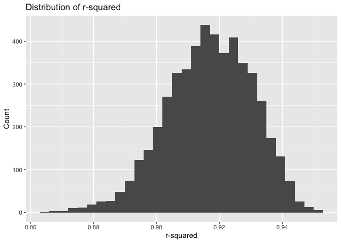

p8105_hw6_wz2630
================

``` r
library(dplyr)
```

    ## 
    ## Attaching package: 'dplyr'

    ## The following objects are masked from 'package:stats':
    ## 
    ##     filter, lag

    ## The following objects are masked from 'package:base':
    ## 
    ##     intersect, setdiff, setequal, union

``` r
library(tidyverse)
```

    ## ── Attaching core tidyverse packages ──────────────────────── tidyverse 2.0.0 ──
    ## ✔ forcats   1.0.0     ✔ readr     2.1.4
    ## ✔ ggplot2   3.4.3     ✔ stringr   1.5.0
    ## ✔ lubridate 1.9.3     ✔ tibble    3.2.1
    ## ✔ purrr     1.0.2     ✔ tidyr     1.3.0

    ## ── Conflicts ────────────────────────────────────────── tidyverse_conflicts() ──
    ## ✖ dplyr::filter() masks stats::filter()
    ## ✖ dplyr::lag()    masks stats::lag()
    ## ℹ Use the conflicted package (<http://conflicted.r-lib.org/>) to force all conflicts to become errors

# Problem 1

(omitted)

# Problem 2

## Dataset:

``` r
weather_df = 
  rnoaa::meteo_pull_monitors(
    c("USW00094728"),
    var = c("PRCP", "TMIN", "TMAX"), 
    date_min = "2022-01-01",
    date_max = "2022-12-31") |>
  mutate(
    name = recode(id, USW00094728 = "CentralPark_NY"),
    tmin = tmin / 10,
    tmax = tmax / 10) |>
  select(name, id, everything())
```

    ## using cached file: /Users/wendyzhou/Library/Caches/org.R-project.R/R/rnoaa/noaa_ghcnd/USW00094728.dly

    ## date created (size, mb): 2023-10-05 10:33:23.821468 (8.527)

    ## file min/max dates: 1869-01-01 / 2023-10-31

## Bootstrapping

The boostrap is helpful when you’d like to perform inference for a
parameter / value / summary that doesn’t have an easy-to-write-down
distribution in the usual repeated sampling framework. We’ll focus on a
simple linear regression with tmax as the response with tmin and prcp as
the predictors, and are interested in the distribution of two quantities
estimated from these data:

- r_hat^2
- log(beta_hat1\*beta_hat2)

1.  Use 5000 bootstrap samples and, for each bootstrap sample, produce
    estimates of these two quantities.

2.  Plot the distribution of your estimates, and describe these in
    words.

3.  Using the 5000 bootstrap estimates, identify the 2.5% and 97.5%
    quantiles to provide a 95% confidence interval for r_hat^2 and
    log(beta_hat1\*beta_hat2).

Note: broom::glance() is helpful for extracting r_hat^2 from a fitted
regression, and broom::tidy() (with some additional wrangling) should
help in computing log(beta_hat1\*beta_hat2).

``` r
set.seed(1)

n_samp = 5000

# define boot_sample function
boot_sample = 
  function(df) {sample_frac(df, replace = TRUE)}

# generate bootstrap samples
boot_straps = 
  tibble(strap_number = 1:5000) |> 
  mutate(
    strap_sample = map(strap_number, \(i) boot_sample(df = weather_df))
    )

boot_straps
```

    ## # A tibble: 5,000 × 2
    ##    strap_number strap_sample      
    ##           <int> <list>            
    ##  1            1 <tibble [365 × 6]>
    ##  2            2 <tibble [365 × 6]>
    ##  3            3 <tibble [365 × 6]>
    ##  4            4 <tibble [365 × 6]>
    ##  5            5 <tibble [365 × 6]>
    ##  6            6 <tibble [365 × 6]>
    ##  7            7 <tibble [365 × 6]>
    ##  8            8 <tibble [365 × 6]>
    ##  9            9 <tibble [365 × 6]>
    ## 10           10 <tibble [365 × 6]>
    ## # ℹ 4,990 more rows

``` r
# generate the estimates of interest
bootstrap_results = 
  boot_straps |> 
  mutate(
    models = map(strap_sample, \(df) lm(tmax ~ tmin+prcp, data = df) ),
    results_1 = map(models, broom::tidy),
    results_2 = map(models, broom::glance)) |> 
  select(-strap_sample, -models) |> 
  unnest(results_1, results_2) 
```

    ## Warning: `unnest()` has a new interface. See `?unnest` for details.
    ## ℹ Try `df %>% unnest(c(results_1, results_2))`, with `mutate()` if needed.

``` r
# pivot results dataset
pivot_bootstrap_results = 
  bootstrap_results |> 
  select(strap_number, term, estimate, r.squared)|>
  pivot_wider(
    names_from = term,
    values_from = estimate
  ) |> 
  mutate(quantity2 = ifelse(tmin * prcp <= 0, NA, log(tmin * prcp)))
```

    ## Warning: There was 1 warning in `mutate()`.
    ## ℹ In argument: `quantity2 = ifelse(tmin * prcp <= 0, NA, log(tmin * prcp))`.
    ## Caused by warning in `log()`:
    ## ! NaNs produced

``` r
# Plot the distribution of your estimates
pivot_bootstrap_results |> 
  ggplot(aes(x = r.squared)) + 
  geom_histogram()
```

    ## `stat_bin()` using `bins = 30`. Pick better value with `binwidth`.

<!-- -->

``` r
pivot_bootstrap_results |> 
  ggplot(aes(x = quantity2)) + 
  geom_histogram() + 
  labs(x = "log(beta_hat1*beta_hat2)")
```

    ## `stat_bin()` using `bins = 30`. Pick better value with `binwidth`.

    ## Warning: Removed 3361 rows containing non-finite values (`stat_bin()`).

<!-- -->

**Comments:**

The distribution of r-squared estimates are approximately normal. The
r-squared values range from 0.86 to 1 and counts range from 0 to about
490.

The distribution of log(beta_hat1xbeta_hat2) is left skewed. There seems
to be outliers based on the histogram.

- Applying log(tmin \* prcp) produced NaNs because log cannot be applied
  to ≤ 0; therefore, I have to explicitly apply to only positive values.

- log(beta_hat1\*beta_hat2) = quantity2

``` r
# 95% confidence intervals

# r-squared
pivot_bootstrap_results |> 
  summarize(
    ci_lower = quantile(r.squared, 0.025), 
    ci_upper = quantile(r.squared, 0.975))
```

    ## # A tibble: 1 × 2
    ##   ci_lower ci_upper
    ##      <dbl>    <dbl>
    ## 1    0.889    0.941

``` r
# quantity2
pivot_bootstrap_results |> 
  summarize(
    ci_lower = quantile(quantity2, 0.025, na.rm = TRUE), 
    ci_upper = quantile(quantity2, 0.975, na.rm = TRUE))
```

    ## # A tibble: 1 × 2
    ##   ci_lower ci_upper
    ##      <dbl>    <dbl>
    ## 1    -8.98    -4.60

**Comments:**

- r-squared 95% CI: (0.889, 0.941)

- log(beta_hat1\*beta_hat2) 95% CI: (-8.98, -4.60)

NAs are ommitted.

The 95% confidence interval for r-squared is **(0.889, 0.941)** and for
log(beta_hat1xbeta_hat2) is **(-8.98, -4.60).**
